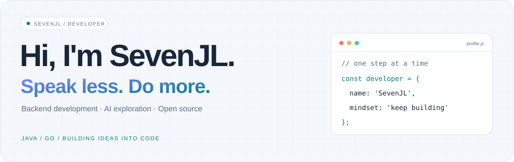
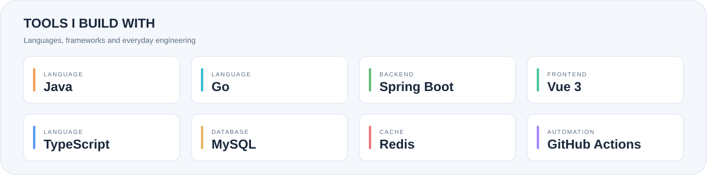
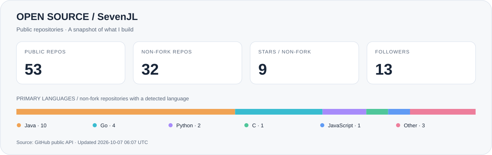
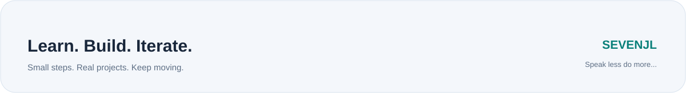

<picture>
  <source media="(prefers-color-scheme: dark)" srcset="./assets/profile-header-dark.svg">
  <source media="(prefers-color-scheme: light)" srcset="./assets/profile-header-light.svg">
  
</picture>

  <a href="https://github.com/SevenJL">GitHub</a> &nbsp; / &nbsp;
  <a href="https://www.sevenjl.cn">个人网站</a> &nbsp; / &nbsp;
  <a href="#projects">精选项目</a> &nbsp; / &nbsp;
  <a href="#stack">技术栈</a> &nbsp; / &nbsp;
  <a href="#activity">开源足迹</a>

## 👋 你好，我是 SevenJL

> **Speak less do more...** 少说一点，多做一点。

来自中国，喜欢把想法写成代码，再把代码变成能用的东西。我的公开项目从 **Java / Spring Boot 后端** 延伸到 **Go 服务开发**，也在探索 **AI 应用、知识库问答与多人实时协作**。

这里记录了我的项目实践、学习笔记和一些有趣的尝试。欢迎逛逛仓库，也欢迎围绕具体项目交流想法。

<table>
  <tr>
    <td width="33%" valign="top"><strong>01 / Backend</strong>  Java、Spring Boot 与 Go，关注接口设计、权限管理和可复用的工程基础。</td>
    <td width="33%" valign="top"><strong>02 / AI &amp; Tools</strong>  探索 RAG 文档问答、插件扩展和 AI 工具，让知识与日常工作连接起来。</td>
    <td width="33%" valign="top"><strong>03 / Build &amp; Learn</strong>  通过实时协作、前后端项目和自动化实践，把学到的知识放进真实代码。</td>
  </tr>
</table>

<h2 id="projects">🚀 精选项目</h2>

| 项目 | 在做什么 | 方向 |
| :-- | :-- | :-- |
| [go-hubvas](https://github.com/SevenJL/go-hubvas) | 多人实时协作画布，结合社区分享、点赞与二次创作 | `Go` · `实时协作` |
| [go-ragbot](https://github.com/SevenJL/go-ragbot) | 知识库检索对话机器人，探索 RAG 文档问答、插件与多轮 Skill | `Go` · `RAG` |
| [go-zero-idempotency-plugin-development](https://github.com/SevenJL/go-zero-idempotency-plugin-development) | 分布式通用幂等性插件，分离核心引擎与框架适配层 | `Go` · `DDD` · `幂等性` |
| [boot-template-dev-init](https://github.com/SevenJL/boot-template-dev-init) | 基于 Spring Boot 3 与 Vue 3 的前后端分离权限管理系统 | `Java` · `Spring Security` · `Vue` |
| [spring-boot-init-template](https://github.com/SevenJL/spring-boot-init-template) | 整合常用框架与业务示例的 Spring Boot 初始模板 | `Java` · `Spring Boot` |
| [uniapp-ts-vue3](https://github.com/SevenJL/uniapp-ts-vue3) | uni-app、TypeScript 与 Vue 3 项目模板 | `TypeScript` · `Vue 3` |

<a href="https://github.com/SevenJL?tab=repositories">查看全部仓库 →</a>

<h2 id="stack">🧰 技术栈与实践方向</h2>

<picture>
  <source media="(prefers-color-scheme: dark)" srcset="./assets/tech-stack-dark.svg">
  <source media="(prefers-color-scheme: light)" srcset="./assets/tech-stack-light.svg">
  
</picture>

这些技术来自我的公开项目，更多细节可以在对应仓库中查看：

- **后端与服务**：Java、Go、Spring Boot、Spring Security、MyBatis-Plus。
- **前端与跨端**：Vue 3、TypeScript、uni-app、Element Plus。
- **数据与工程**：MySQL、Redis、Git、GitHub Actions。
- **探索方向**：RAG、插件化工具、分布式幂等性、实时协作。

## 🌱 持续探索

从现有项目出发，继续把这些方向做深、做实：

- **让服务更可靠**：研究重复请求、权限边界与框架适配，减少业务代码中的重复处理。
- **让知识更好用**：探索检索与对话结合的方式，把文档转化为可交互的知识入口。
- **让协作更自然**：围绕在线画布，实践多人同步与社区创作体验。
- **让开发更顺手**：积累项目模板与自动化流程，让下一次开发更容易起步。

<h2 id="activity">📊 开源足迹</h2>

<picture>
  <source media="(prefers-color-scheme: dark)" srcset="./assets/github-activity-dark.svg">
  <source media="(prefers-color-scheme: light)" srcset="./assets/github-activity-light.svg">
  
</picture>

基于 GitHub 公开 API 的统计快照 · 语言按非 Fork 仓库的主要语言计数 · 图中标注更新时间

## 💬 找到我

- **GitHub**：[SevenJL](https://github.com/SevenJL)
- **个人网站**：[www.sevenjl.cn](https://www.sevenjl.cn)
- **项目交流**：欢迎在对应仓库的 Issues 中讨论问题、建议和改进方向。

 

<picture>
  <source media="(prefers-color-scheme: dark)" srcset="./assets/profile-footer-dark.svg">
  <source media="(prefers-color-scheme: light)" srcset="./assets/profile-footer-light.svg">
  
</picture>
